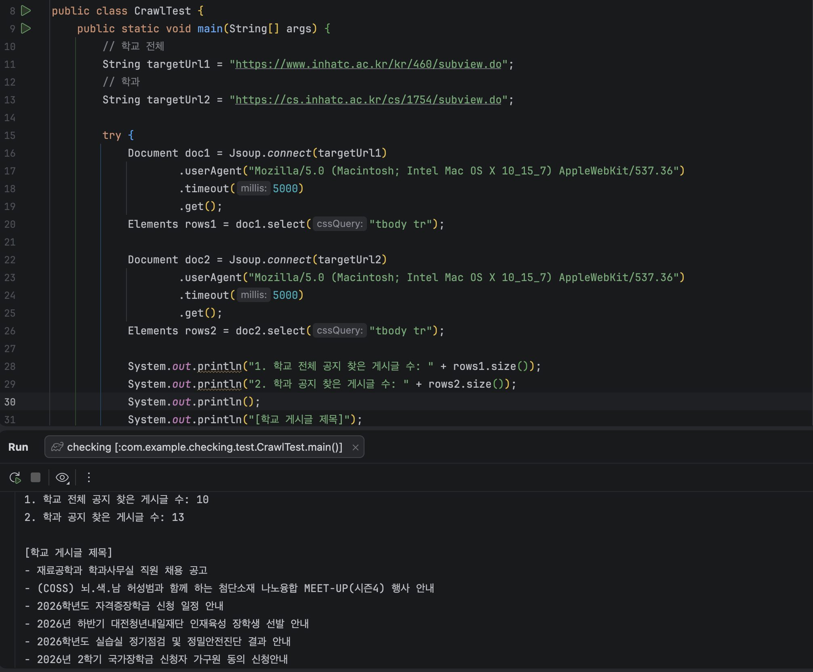
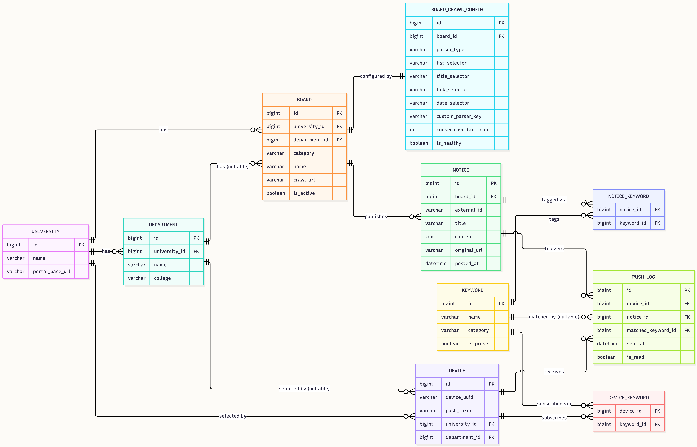

# 3주차 개발일지

**📅 날짜**: 2026.09.09 ~ 2026.09.15
**이번 주 진행 항목**: 크롤링 가능 여부 검증 / 데이터베이스 설계 / 개발 환경 세팅

---

## 1. 크롤링 가능 여부 검증

### 대상
- 인하공업전문대학 전체 공지 게시판
- 인하공업전문대학 학과 공지 게시판

### 검증 방법
순수 Java + Jsoup으로 실제 게시판 목록 페이지를 파싱해 게시글 개수/제목/링크가 정상적으로 추출되는지 테스트

### 결과
`<a href="/bbs/cs/104/110401/artclView.do">` 형태로 실제 URL이 href에 직접 노출되어 있어 바로 사용 가능

---

## 2. 데이터베이스 설계
**DB**: MariaDB (12.3.3 LTS)

| 테이블 | 역할 |
|---|---|
| university | 서비스 대상 대학교 기본 정보 관리 |
| department | 대학에 속한 학과 정보 관리 |
| board | 크롤링 대상 공지사항 게시판 마스터 |
| board_crawl_config | 게시판별 CSS 셀렉터 및 JSON API 구조를 데이터화하여 관리 |
| notice | 파싱된 정제 공지 데이터 |
| device | 로그인 없는 익명 사용자 단위(Flutter UUID + FCM Push Token 관리) |
| keyword | 서비스 프리셋 키워드 및 사용자 정의 커스텀 키워드 관리 |
| device_keyword | 사용자(Device)와 구독 키워드 간의 N:M 관계 테이블 |
| notice_keyword | 크롤링 시점에 공지글과 프리셋 키워드를 미리 매칭해 둔 성능 향상용 캐시 테이블 |
| push_log | FCM 푸시 알림 발송 이력 및 중복 발송 방지용 매핑 테이블 |

---

## 3. 개발 환경 세팅

### 설치 완료 항목
| 항목 | 버전/도구 |
|---|---|
| Java | 17 (Temurin/OpenJDK) |
| Spring Boot | 3.2.5 |
| Gradle | 8.5 |
| IntelliJ IDEA | Ultimate |
| MariaDB | 12.3.3 LTS |
| DB GUI | DBeaver Community |
| 프론트엔드 | Flutter (Dio, Riverpod, Freezed, Hive 등 의존성 세팅) |
| 버전관리 | Git/GitHub (SSH 키 등록) |

## 4. 다음주 계획

**워킹 스켈레톤 완성**
크롤러 → DB 저장 → API 조회

