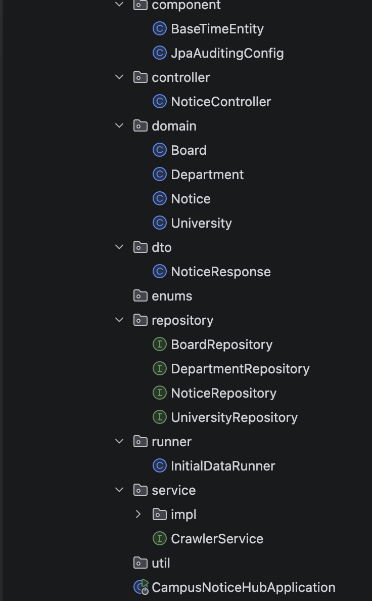
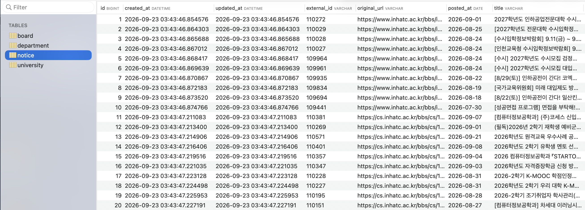

# 4주차 개발일지

**📅 날짜**: 2026.09.16 ~ 2026.09.22
**이번 주 진행 항목**: DB 엔티티 구현 / 초기 데이터 시딩 / 크롤러 서비스 구현 / API 구현 / 워킹 스켈레톤 검증

---

## 1. DB 엔티티 구현

지난주 설계한 ERD를 기준으로 JPA 엔티티를 구현했다.

| 엔티티 | 역할 |
|---|---|
| University | 대학교 기본 정보 (다중 대학 확장을 고려해 `portalBaseUrl` 등 보유) |
| Department | University에 소속된 학과 정보 |
| Board | 크롤링 대상 게시판. `department_id`가 null이면 전체(학교 단위) 게시판, 값이 있으면 학과 게시판으로 구분 |
| Notice | 파싱된 공지 데이터. `board_id` + `external_id` 조합에 유니크 제약을 걸어 중복 저장 방지 |

패키지 구조는 **레이어별**(`component` / `domain` / `enums` / `repository` / `service`·`service.impl` / `controller` / `runner` / `util`)로 정리했다.

---

## 2. 초기 데이터 시딩

`CommandLineRunner`를 구현한 `InitialDataRunner`로 서버 최초 기동 시 다음 데이터를 자동 등록하도록 했다.

- University 1건 (인하공업전문대학)
- Department 1건 (컴퓨터정보공학과)
- Board 2건 (전체공지 게시판 / 컴퓨터정보과공지 게시판)

`universityRepository.count() > 0`이면 즉시 종료하는 가드를 걸어 재기동 시 중복 삽입을 방지했다.

---

## 3. 크롤러 서비스 구현

`CrawlerService` 인터페이스 / `CrawlerServiceImpl` 구현체를 `service` / `service.impl`로 분리해 작성했다. `
@Scheduled(fixedRate = 360000)`로 개발 중 1시간 주기 크롤링, `@Transactional`로 저장 단위를 묶었다.

---

## 4. API 구현

JPA 엔티티를 컨트롤러에서 직접 노출하지 않기 위해 `NoticeResponse` DTO(`NoticeResponse.from(Notice)`)를 만들고, `NoticeController`에서 `GET /api/notices`로 전체 공지 목록을 반환하도록 구현했다.

---

## 5. 워킹 스켈레톤 검증 결과

서버 기동 → 스케줄러가 두 게시판 크롤링 → `GET /api/notices` 호출까지 실제로 확인했다.

- 전체공지 게시판: 10건
- 컴퓨터정보과공지 게시판: 10건
- 총 20건의 실제 공지사항이 제목 / 원본 URL / 게시일 / 게시판명을 포함한 JSON으로 정상 응답
- 중복 저장 없이 dedup 로직 정상 동작

  
지난주 목표였던 **크롤러 → DB 저장 → API 조회** 워킹 스켈레톤이 실제 데이터로 end-to-end 동작함을 확인했다.

---

## 6. 다음 주 계획

**디바이스/키워드 온보딩 기능 구현**
- `Device`, `Keyword`, `DeviceKeyword` 엔티티 및 레포지토리 추가
- 프리셋 키워드 시딩
- 디바이스 등록/수정 API (`POST /api/devices`, `PATCH /api/devices/{id}`)
- 키워드 조회/구독 API (`GET /api/keywords`, `POST`/`DELETE /api/devices/{id}/keywords`)
- 학과 필터 + 키워드 필터를 결합한 피드 API (`GET /api/feed?deviceId=...`)

